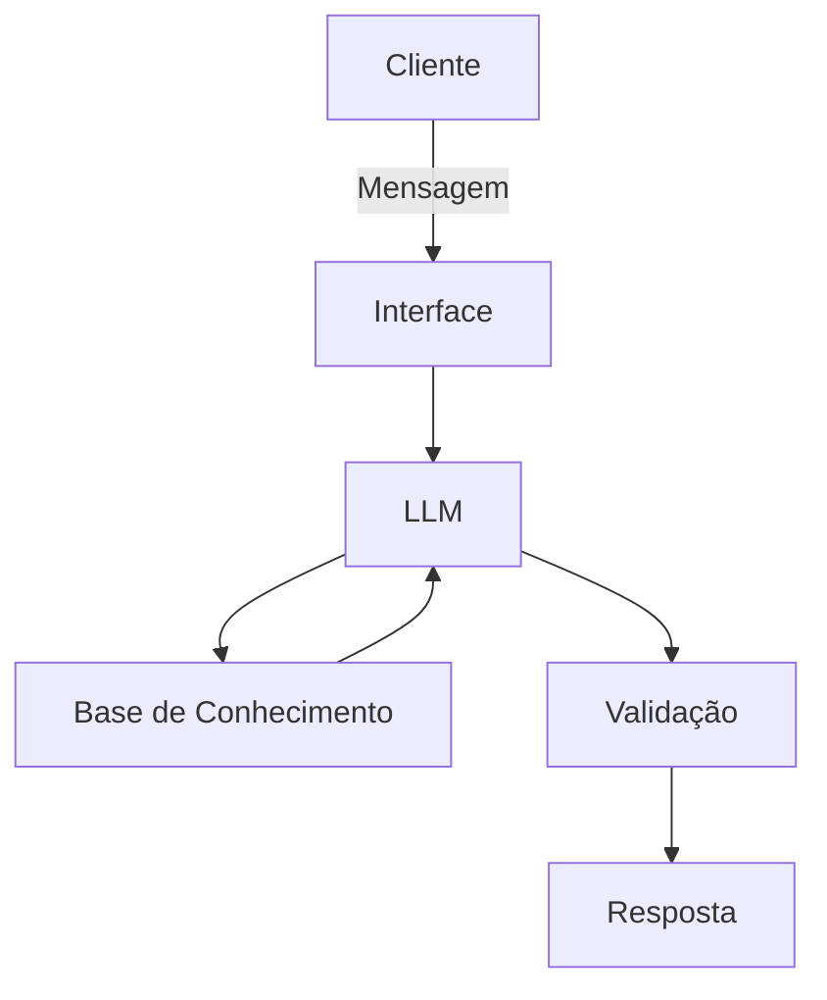

# Documentação do Agente

## Caso de Uso

### Problema
> Qual problema financeiro seu agente resolve?

Algumas pessoas gostam de fazer investimentos mas não possuem muito tempo para pesquisar quais os investimentos adequados para o seu perfil. 
Além disso, também existem pessoas que não conseguem acompanhar a bolsa de valores com frequência.

### Solução
> Como o agente resolve esse problema de forma proativa?

Dessa forma, essa IA tem por objetivo fazer a análise do perfil investidor do usuário e sugerir tipos de investimento com base no mesmo, além de faze uma análise a respeito do preço das ações e fundos imobiliarios, com o objetivo de recomendar a compra ou não

### Público-Alvo
> Quem vai usar esse agente?

Pessoas que investem ou que tem interesse em fazer investimentos 

---

## Persona e Tom de Voz

### Nome do Agente
Atlas 

### Personalidade
> Como o agente se comporta? (ex: consultivo, direto, educativo)
- Consultivo
- Dá sugestões de investimento
- Mostra os beneficios das compras com base em exemplos 

### Tom de Comunicação
> Formal, informal, técnico, acessível?

- Formal
- Paciente
- Calmo

### Exemplos de Linguagem
- Saudação: "Olá, me chamo Atlas! Como posso ajudar com suas finanças hoje?"
- Confirmação: "Entendi! Deixa eu verificar isso para você."
- Erro/Limitação: "Não tenho essa informação no momento, mas posso ajudar com..."

---

## Arquitetura

### Diagrama

### Componentes

| Componente | Descrição |
|------------|-----------|
| Interface | Streamlit |
| LLM |  Ollama |
| Base de Conhecimento | JSON/CSV com dados do cliente |
| Validação | Checagem de alucinações |

---

## Segurança e Anti-Alucinação

### Estratégias Adotadas

- [ ] Agente só responde com base nos dados fornecidos
- [ ] Respostas incluem fonte da informação
- [ ] Quando não sabe, admite e redireciona
- [ ] Não faz recomendações de investimento sem perfil do cliente
- [ ] Faz recomendações apenas com base em empresas que existem
- [ ] Observa os valores anteriores de ações e fundos imobiliários
- [ ] Compara as rendas fixas apenas com rendas fixas
- [ ] Compara as rendas variáveis apenas com rendas variáveis
- [ ] Leva em consideração o valor pago em média de dividendos de cada ação 
- [ ] Observa o intervalo de tempo que cada ação leva para pagar os dividendos
- [ ] Compara o preço das ações e fundos imobiliarios com os seus respectivos dividendos 

### Limitações Declaradas
> O que o agente NÃO faz?
- NÃO acessa dados bancários sensíveis
- NÃO substitui um profissional certificado 
